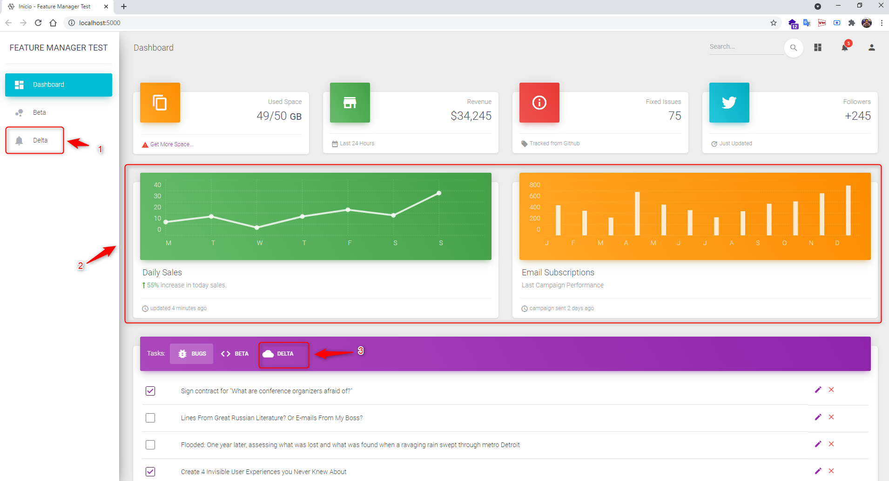

# Feature Flags Example
## Descripción

Este proyecto desarrollado en en .Net 5.0 y con el que se busca validar el uso de la caracteristica de las [Feature Flag](https://docs.microsoft.com/en-us/azure/azure-app-configuration/quickstart-feature-flag-aspnet-core?tabs=core5x) en Microsoft Azure.

1. Para este ejemplo se crearon dos Feature Flags en Azure:

2. Se crea un proyecto en .Net 5.0 con el look and feel en Material Desing con una de las plantillas de [Creative Tim](https://www.creative-tim.com/product/material-dashboard#)

3. Se realiza la integración de los Feature Flags con el proyecto y se agregan los componentes que habilitariamos o inhabilitariamos, y paso seguido habilitamos la opción para que se muestren los features de Beta:

En el proyecto se habilitarian las opciones relacionadas a la caracreristicas Beta:

4. Por ultimo habilitamos la opción para que se muestren los features de Delta:

En el proyecto se habilitarian las opciones relacionadas a la caracreristicas Delta:

## *Compilar y ejecutar con dotnet:*

**Compilar:**

    ~]$ dotnet build

**Ejecutar Proyecto:**

    ~]$ dotnet run

